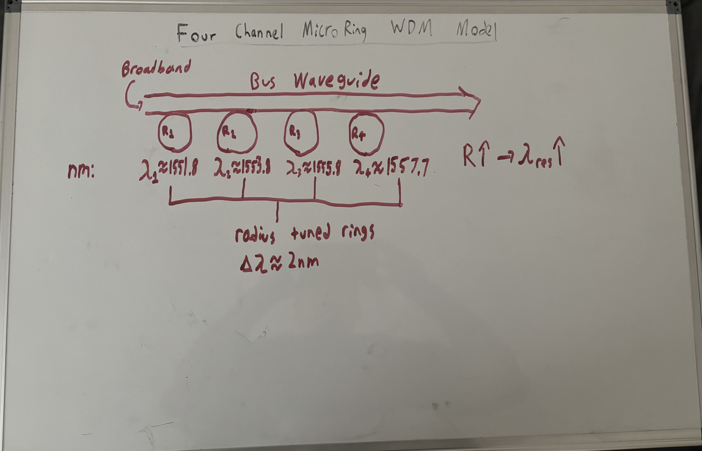
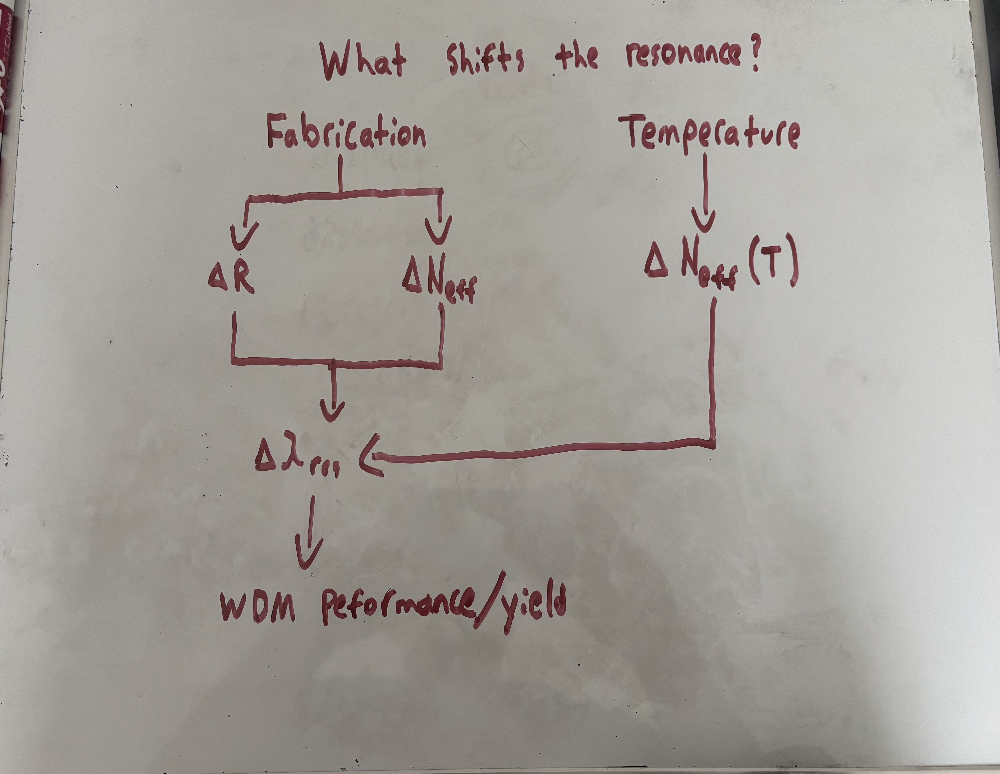
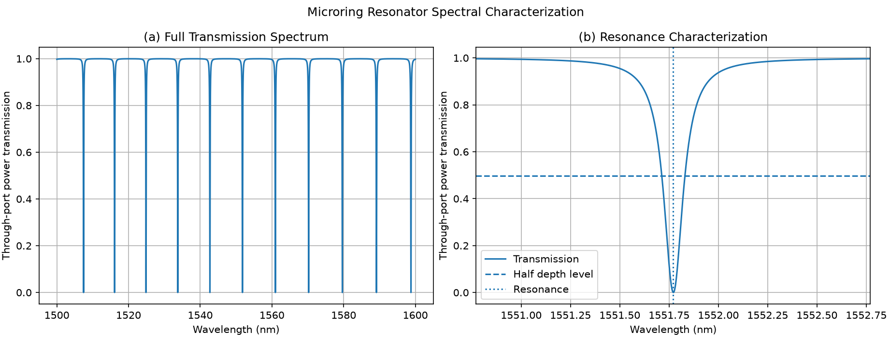
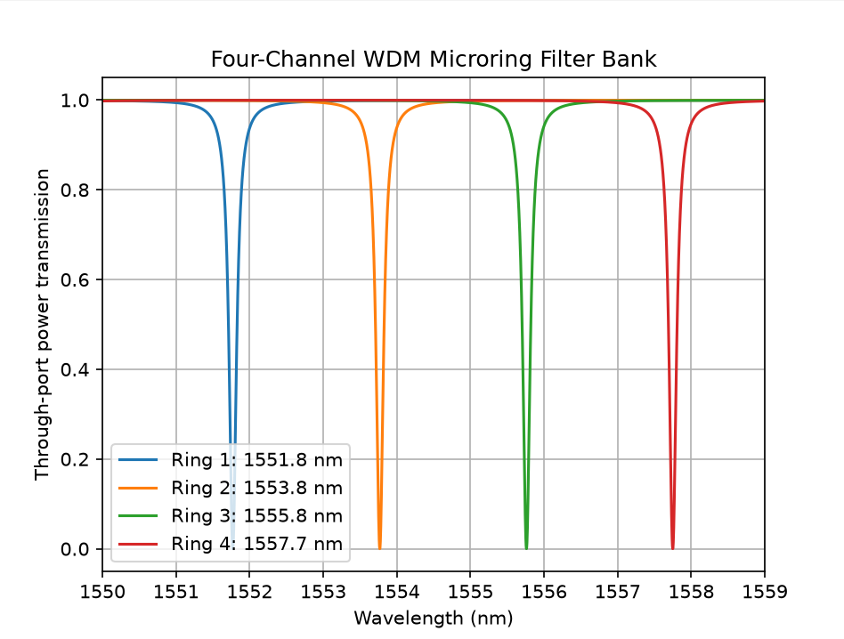
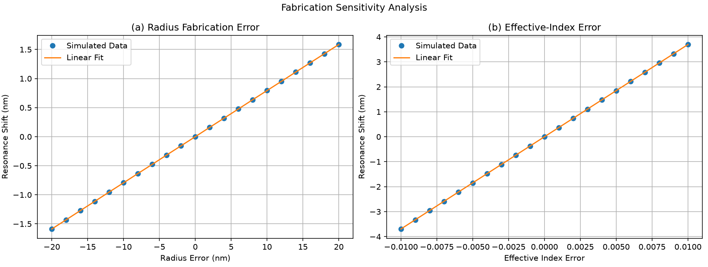
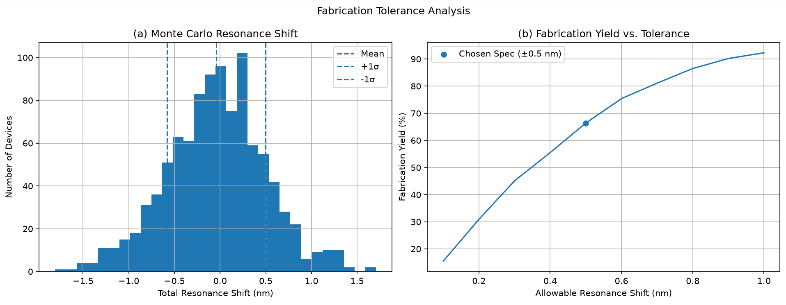
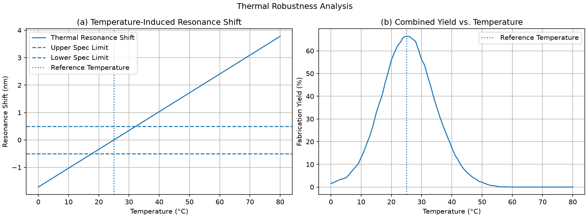

# Silicon-Photonic WDM Link

A Python model of a four-channel silicon-photonic wavelength-division
multiplexing (WDM) filter bank using microring resonators.

The project started with a simple question: **how accurately can a
microring-based WDM system maintain its designed wavelength channels
when fabrication errors and temperature changes are introduced?**

I first modeled the wavelength-dependent through-port response of a
dispersive silicon microring resonator, then used small changes in ring
radius to create four resonances with approximately 2 nm channel
spacing. The model was then extended to study radius and effective-index
fabrication errors, Monte Carlo fabrication yield, and
temperature-induced resonance shifts.

The nominal design produced four resonances from approximately
**1551.8--1557.7 nm**, with a mean channel spacing of **1.993 nm**. The
nominal ring had a **0.118 nm FWHM** and a **Q factor of approximately
13,150**.

Under the assumed fabrication distributions and a project-defined **±0.5
nm resonance-shift criterion**, **66.4%** of 1000 simulated devices
remained within the allowed range. The model also predicted a thermal
sensitivity of approximately **68.7 pm/°C**, showing why thermal control
or active tuning can become important in a practical microring WDM
system.

## Project Goals

The main goals of the project were to:

-   Build a wavelength-dependent silicon waveguide and microring model
    from basic optical relationships.
-   Design a four-channel microring WDM filter bank with approximately 2
    nm channel spacing.
-   Characterize resonance wavelength, FSR, linewidth, Q factor,
    extinction ratio, and channel selectivity.
-   Determine how ring-radius and effective-index errors shift the
    designed resonances.
-   Use Monte Carlo simulation to estimate yield under explicitly stated
    fabrication assumptions.
-   Study how temperature-induced effective-index changes affect
    resonance placement and combined yield.

The emphasis is on understanding the engineering tradeoffs of a
simplified first-order model rather than reproducing a specific foundry
process.

## System Architecture

The modeled system consists of a bus waveguide coupled to four microring
resonators. Each ring has a slightly different radius, shifting its
resonance to a different wavelength and producing four
wavelength-selective responses.

The nominal resonances are approximately:

  Channel     Resonance wavelength
  --------- ----------------------
  1                    1551.771 nm
  2                    1553.769 nm
  3                    1555.763 nm
  4                    1557.749 nm

The mean channel spacing is approximately **1.993 nm**. Increasing ring
radius shifts the resonance toward longer wavelengths, which is the
tuning mechanism used to construct the filter bank.

> **Model scope:** the rings are modeled as all-pass microring
> resonators using their **through-port response**. This is not a
> complete add-drop demultiplexer with explicitly modeled drop ports.




## Model Theory

### Effective-Index Dispersion

The effective index of the waveguide changes with wavelength, so I used
a first-order dispersion model rather than assuming a constant effective
index. The relationship between effective index and group index is

$$
n_g = n_{\mathrm{eff}} - \lambda \frac{dn_{\mathrm{eff}}}{d\lambda}
$$

which gives the approximate slope

```math
\frac{dn_{\mathrm{eff}}}{d\lambda}
=
\frac{n_{\mathrm{eff},0}-n_g}{\lambda_0}.
'''

The wavelength-dependent effective index is then approximated as

$$
n_{\mathrm{eff}}(\lambda)
\approx
n_{\mathrm{eff},0}
+
\frac{dn_{\mathrm{eff}}}{d\lambda}
(\lambda-\lambda_0).
$$

This is used to calculate the propagation constant

$$
\beta(\lambda)=\frac{2\pi n_{\mathrm{eff}}(\lambda)}{\lambda}.
$$

This matters because the phase accumulated by light traveling around the
ring depends on both wavelength and effective index.

### Microring Resonance

For a ring with radius (R), the round-trip length is

$$
L=2\pi R.
$$

A resonance occurs when the light accumulates an integer number of
(2`\pi`{=tex}) phase cycles after one trip around the ring:

$$
\beta L = 2\pi m,
$$

where (m) is the resonance order. This can also be written approximately
as

$$
m\lambda_{\mathrm{res}} = n_{\mathrm{eff}}L.
$$

Changing either the ring radius or effective index changes the optical
path length and therefore shifts the resonant wavelength. I use this
relationship both to tune the four WDM channels and to model fabrication
and temperature errors.

### Through-Port Transmission

Each ring is modeled as an all-pass microring resonator. The
through-port power transmission is

$$
T(\lambda)=
\frac{
a^2+t^2-2at\cos(\beta L)
}{
1+(at)^2-2at\cos(\beta L)
},
$$

where (a) represents round-trip field-amplitude transmission and (t) is
the self-coupling coefficient, with

$$
t=\sqrt{1-\kappa^2}.
$$

At resonance, interference between light traveling through the bus
waveguide and light coupled back from the ring produces a sharp dip in
through-port transmission.

### FSR, Linewidth, and Q Factor

Because multiple resonance orders satisfy the phase condition, each ring
has a series of resonances. The approximate free spectral range is

$$
\mathrm{FSR}\approx\frac{\lambda^2}{n_gL}.
$$

For the nominal ring, the analytical FSR is approximately **9.104 nm**,
while the numerical model gives approximately **9.133 nm**, a difference
of about **0.32%**.

The resonance linewidth is characterized using the full width at half
maximum (FWHM). The quality factor is

$$
Q=\frac{\lambda_{\mathrm{res}}}{\Delta\lambda_{\mathrm{FWHM}}}.
$$

The nominal resonance near **1551.771 nm** has a FWHM of approximately
**0.118 nm** and a Q factor of approximately **13,150**.

### Fabrication Sensitivity

Small fabrication errors can shift the resonances away from their
designed wavelengths. I modeled two sources of variation: ring-radius
error and effective-index error.

Over the ranges tested, both produced approximately linear resonance
shifts:

$$
\Delta\lambda_R \approx S_R\Delta R
$$

and

$$
\Delta\lambda_n \approx S_n\Delta n_{\mathrm{eff}}.
$$

The fitted sensitivities are

$$
S_R \approx 0.0794\ \mathrm{nm/nm}
$$

and

$$
S_n \approx 369.48\ \mathrm{nm/index\ unit}.
$$

These sensitivities are used in the Monte Carlo analysis to estimate the
total resonance shift caused by simultaneous radius and effective-index
variation.

### Thermal Sensitivity

Temperature also changes the effective index. I model this using

'''math
\Delta n_{\mathrm{eff}}
=
\frac{dn_{\mathrm{eff}}}{dT}\Delta T,
'''

with an assumed thermo-optic coefficient of

'''math
\frac{dn_{\mathrm{eff}}}{dT}
=
1.86\times10^{-4}\ \mathrm{K}^{-1}.
'''

Using the previously calculated effective-index sensitivity,

'''math
\Delta\lambda_T
=
S_n
\frac{dn_{\mathrm{eff}}}{dT}
\Delta T.
'''

The resulting modeled thermal sensitivity is approximately

'''math
\frac{d\lambda}{dT}
\approx
0.0687\ \mathrm{nm/^\circ C}
=
68.7\ \mathrm{pm/^\circ C}.
'''

With the project-defined ±0.5 nm acceptance criterion, the nominal
device reaches that resonance-shift limit after a temperature change of
approximately **±7.28°C** from the 25°C reference temperature.

## Nominal Microring Performance

The first part of the model checks whether the nominal ring behaves as
expected before extending it into a WDM system.

Key nominal results:

  Metric                                       Result
  ------------------------------------- -------------
  Resonance wavelength                    1551.771 nm
  Analytical FSR                             9.104 nm
  Numerical FSR                              9.133 nm
  Analytical/numerical FSR difference          0.316%
  FWHM                                       0.118 nm
  Q factor                                     13,150
  Extinction ratio                           45.78 dB

The close agreement between analytical and numerical FSR provides a
useful sanity check on the first-order model.

Because the nominal parameters place the ring close to critical coupling
($a \approx t$), the bottom of the through-port resonance is much sharper
than the overall linewidth. A locally refined wavelength grid is therefore
used around each resonance minimum when calculating minimum transmission
and extinction ratio. This gives a nominal extinction ratio of approximately
**45.78 dB** without requiring an unnecessarily dense grid across the full
spectrum.


## Four-Channel WDM Filter Bank

The nominal ring is extended into a four-channel filter bank by slightly
increasing the radius of each successive ring. This produces resonances
at approximately **1551.771, 1553.769, 1555.763, and 1557.749 nm**.

The adjacent channel spacings are approximately **1.998, 1.994, and
1.986 nm**, giving a mean spacing of **1.993 nm**.

The total WDM bandwidth is approximately **5.978 nm**, which remains
inside the approximately **9.133 nm** numerical FSR. The mean channel
spacing is also about **16.9 times the 0.118 nm resonance linewidth**,
providing clear spectral separation in the modeled response.

After locally refining the wavelength grid around each resonance minimum,
the modeled on-channel through-port transmission is approximately **-45.8 dB**
for all four rings, while the worst off-channel transmission is approximately
**-0.0045 dB**, corresponding to an off-channel power penalty of roughly
**0.103%**.


## Fabrication Sensitivity Analysis

After establishing the nominal WDM design, I tested how sensitive
resonance placement is to two fabrication-related parameters.

The fitted radius sensitivity is approximately **0.0794 nm of resonance
shift per nanometer of radius error**. The fitted effective-index
sensitivity is approximately **369.48 nm per index unit**.

These values make the tolerance problem easier to see. For example, a 5
nm radius error corresponds to a first-order resonance shift of about
**0.40 nm**, already several times the nominal 0.118 nm linewidth.


## Monte Carlo Fabrication Tolerance

To move beyond individual parameter sweeps, I simulated **1000 devices**
with independent random radius and effective-index errors.

The assumed distributions are:

-   Ring-radius standard deviation: **5 nm**
-   Effective-index standard deviation: **0.001**
-   Random seed: **42** for reproducibility

The radius-induced resonance-shift standard deviation is approximately
**0.392 nm**, while the effective-index contribution is approximately
**0.375 nm**. Combined, the modeled resonance-shift standard deviation
is approximately **0.540 nm**.

The variance is split fairly evenly between the two modeled error
sources: approximately **52.3%** from radius variation and **47.7%**
from effective-index variation.

Using a **project-defined ±0.5 nm resonance-shift acceptance
criterion**, **664 of 1000 devices pass**, corresponding to a simulated
yield of **66.4%**.

The criterion is intentionally treated as a project assumption rather
than a foundry specification. Changing the allowable shift changes the
calculated yield; for example, the model gives approximately **15.5%**
yield at ±0.1 nm and **92.3%** at ±1.0 nm.


## Thermal Robustness

Using an assumed silicon thermo-optic coefficient of
$1.86 \times 10^{-4}\ \mathrm{K}^{-1}$, the model predicts
a thermal resonance sensitivity of approximately **68.7 pm/°C**.

Relative to the 25°C reference temperature, the nominal thermal shift is
approximately:

  Temperature     Resonance shift
  ------------- -----------------
  0°C                   -1.718 nm
  25°C                       0 nm
  80°C                  +3.780 nm

The ideal nominal device reaches the project-defined ±0.5 nm
resonance-shift limit after approximately **±7.28°C** from the 25°C
reference temperature.

I then combined the thermal shift with the same Monte Carlo fabrication
population. Under the model assumptions, the resulting yield is
approximately **1.6% at 0°C**, **66.4% at 25°C**, and **0% at 80°C**.

This does not model an active thermal-control system. Instead, it shows
how strongly resonance placement can depend on temperature in an
uncompensated first-order microring model.



## Model Validation

I performed several numerical checks to verify that the reported results were not artifacts of the simulation settings.

### Monte Carlo Convergence

The baseline tolerance analysis uses 1,000 simulated devices and a fixed random seed of 42, producing a fabrication yield of 66.4% under the project-defined ±0.5 nm resonance-shift criterion.

Increasing the simulated population produced:

| Simulated Devices | Fabrication Yield | Resonance-Shift Std. Dev. |
| ---: | ---: | ---: |
| 1,000 | 66.4% | 0.5404 nm |
| 10,000 | 64.6% | 0.5414 nm |
| 100,000 | 64.3% | 0.5435 nm |

The larger simulations indicate that the modeled yield converges to approximately 64–65%, while the resonance-shift standard deviation remains near 0.54 nm.

### Random-Seed Robustness

Five additional 1,000-device simulations using seeds of 1, 10, 100, 1000, and 2026 produced fabrication yields between 63.5% and 65.1%. The corresponding resonance-shift standard deviations ranged from approximately 0.524 to 0.556 nm.

This indicates that the overall fabrication-tolerance conclusion is not dependent on the baseline random seed.

### Wavelength-Grid Convergence

The spectral model was also tested using 10,000, 50,000, and 100,000 wavelength samples. The validation script returned an FSR of approximately 9.126 nm at all three resolutions, while the extracted resonance wavelength varied by no more than 0.004 nm. The small difference between this value and the baseline 9.133 nm result comes from the resonance-order sampling used in the validation calculation; both remain close to the 9.104 nm analytical estimate.

The FWHM and Q factor showed slightly greater grid sensitivity because they depend on locating the half-depth crossings of a discretely sampled resonance. Increasing the grid from 50,000 to 100,000 samples changed the FWHM from 0.118 to 0.117 nm and the Q factor from 13,150 to 13,263.

Based on these results, 50,000 wavelength samples were retained as the baseline resolution.

### Analytical Sensitivity Check

The numerically fitted radius sensitivity was also compared with a first-order analytical estimate derived from the microring resonance condition:

$$
\frac{d\lambda}{dR}
\approx
\frac{\lambda n_{\mathrm{eff}}}{R n_g}.
$$

Using the nominal model parameters gives an analytical radius sensitivity of approximately **0.07938 nm/nm**, compared with the numerically fitted value of **0.07938 nm/nm**. The two values agree to within approximately **0.01%** at the reported precision.


## Key Engineering Takeaways

1.  **Radius tuning can create a compact four-channel WDM response.**
    The modeled design achieves approximately 2 nm spacing across four
    resonances while remaining within one FSR.
2.  **The nominal resonances are narrow compared with the channel
    spacing.** A 0.118 nm FWHM gives a channel-spacing-to-linewidth
    ratio of about 16.9.
3.  **Resonance placement is highly sensitive to small parameter
    changes.** Nanometer-scale radius errors and small effective-index
    errors can shift the resonance by multiple linewidths.
4.  **Fabrication variation is not dominated by only one modeled
    source.** Under the chosen assumptions, radius and effective-index
    variation contribute about 52% and 48% of the resonance-shift
    variance.
5.  **Temperature is a major robustness constraint in the uncompensated
    model.** A predicted sensitivity of 68.7 pm/°C means relatively
    small temperature changes can move a channel outside the chosen ±0.5
    nm window.

The main lesson from the project is that producing the desired nominal
spectrum is only part of the design problem. A useful WDM design also
has to maintain resonance alignment when geometry, material properties,
and temperature move away from their nominal values.

## Model Assumptions and Limitations

This is a first-order engineering model, not a foundry-qualified device
simulation. Important limitations include:

-   The waveguide uses a first-order effective-index dispersion
    approximation.
-   Microrings are modeled using an analytical all-pass through-port
    response rather than a full electromagnetic solver.
-   Round-trip loss and coupling parameters are held constant across the four
    ring radii; geometry-dependent changes in coupling and loss are not modeled.
-   The model does not use a foundry PDK or process-specific statistical
    data.
-   The assumed fabrication variations ($\sigma_R = 5$ nm and
    $\sigma_{n_{\mathrm{eff}}} = 0.001$) are project assumptions.
-   The ±0.5 nm resonance-shift acceptance criterion is project-defined
    and is not presented as an industry or foundry specification.
-   Temperature dependence is represented through a constant
    thermo-optic coefficient.
-   Thermal expansion, detailed geometry-dependent material changes,
    heaters, and active resonance control are not modeled.
-   The model does not include explicit drop ports, modulators,
    photodetectors, BER, data-rate performance, or a complete optical
    transceiver.
-   No fabricated device or tapeout is claimed.

These limitations are intentional: the project focuses on microring/WDM
fundamentals, tolerance analysis, and engineering interpretation without
expanding into a full photonic integrated circuit simulator.

## Repository Structure

```text
Silicon-Photonic-WDM-Link/
├── README.md
├── requirements.txt
├── figures/
│   └── [project figures and architecture diagrams]
└── src/
    ├── waveguide.py
    ├── ring_resonator.py
    └── validation.py
```

`waveguide.py` contains the foundational waveguide/dispersion calculations
used while developing the model.

`ring_resonator.py` contains the microring transmission model, resonance
characterization, four-channel WDM design, fabrication sensitivity analysis,
Monte Carlo tolerance analysis, and thermal analysis.

`validation.py` independently reproduces the Monte Carlo convergence,
random-seed robustness, wavelength-grid convergence, and analytical
radius-sensitivity checks reported in the validation section.

## Running the Model

The project requires Python, NumPy, and Matplotlib.

Install the required packages from the repository root:

```bash
py -m pip install -r requirements.txt
```

Then run the baseline model:

```bash
py src/ring_resonator.py
```

Run the independent validation checks with:

```bash
py src/validation.py
```

The baseline simulation uses 50,000 wavelength samples, 1,000 Monte Carlo
devices, and a fixed random seed of 42 so the reported baseline results can be
reproduced consistently. On systems where `python` points to the desired Python
installation, `python` can be used instead of the Windows `py` launcher.

## Future Work

The current project scope intentionally stops at a first-order
analytical model. Logical extensions could include comparison against a
foundry PDK, geometry-dependent mode solving, active thermal tuning, an
add-drop architecture, or experimental comparison with fabricated
devices.

Those extensions are not part of the results presented in this
repository.

## Tools

-   Python
-   NumPy
-   Matplotlib
-   VS Code
